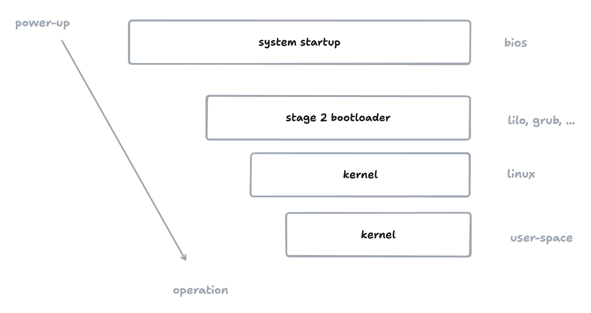

# Building a Custom Init System for Firecracker MicroVMs

If you’ve worked with containers, you’re used to environments where there’s no need for an init system. A container runs your application directly as PID 1. The host kernel is already running, and the container just launches a single isolated process. There’s no boot sequence, no services to manage, and no systemd involved.

MicroVMs, like those run by [Firecracker](https://firecracker-microvm.github.io/), work differently. Firecracker doesn't just start a process inside the host. It boots a full Linux kernel in a virtual machine. Once that kernel is up, it expects to run an init process as PID 1, just like on a normal Linux system. If there isn’t one, the kernel panics or shuts down.

When you use a full Linux distribution as your root filesystem, like Ubuntu or Fedora, it already includes an init system. But when you build a minimal root filesystem based on a container image, you often leave that out. That’s when you need to provide your own init.

In this post, we’ll build a _very_ simple custom init process for a Firecracker microVM. It will bring up the system, start a few long-running processes, and keep the VM running. It's just enough logic to get things going.

---

## What is an Init System?

The **init system** is the first process that the Linux kernel starts once it finishes booting. It becomes **process ID 1 (PID 1)** and is responsible for setting up the user space and starting everything else.


*Diagram: The Linux boot sequence. After the BIOS and bootloader run, the kernel is loaded. The kernel then starts the init system (PID 1), which brings up the rest of user space.*


A few key points about init systems:
- They are **daemon processes** that run during the entire lifetime of the system.
- If the init system crashes or exits, the **kernel panics** and the system goes down.
- Different operating systems use different init systems. For example:
  - macOS uses `launchd`
  - Ubuntu and most modern Linux distributions use `systemd`
  - Alpine Linux often uses `openrc`
  - There are many alternative or hobby init systems out there.

The most common Linux init system today is **systemd**. However, lighter alternatives like **openrc** are popular for minimal distributions like Alpine Linux.

Some platforms even build their own. For example, Fly.io developed a small, rust-based init system to quickly boot microVMs. Although it is now archived and unmaintained, you can find it [here](https://github.com/superfly/init-snapshot).

If you only need to run a **single process** (like a web server) inside a Linux environment, you could, in theory, **run that process directly as PID 1** without any formal init system. You can do so by passing in the path to the binary as a kernel argument like `init=/path/to/binary`. Check your kernel command line by doing `cat /proc/cmdline`. However, PID 1 has a few special responsibilities (like properly handling signals and reaping zombie processes), which is why even minimal setups often benefit from a small init program.


### History of Init Systems

The idea of an init system goes back to the earliest versions of Unix. The original init was a simple program that ran scripts in a fixed order to start system services. It followed a clear, linear process: start networking, start logging, start the user shell.

For many years, most Linux distributions used [SysVinit](https://github.com/slicer69/sysvinit), which was based on that classic Unix approach. It relied on numbered runlevels and a collection of shell scripts placed in specific directories like /etc/init.d.

As Linux systems became more complex and needed faster and more parallel startup, newer init systems emerged. The most prominent of these is [systemd](https://systemd.io/), which is now the default in most major distributions, including Ubuntu, Debian, Fedora, and Arch. Systemd uses a unit-based model and supports parallel service startup, socket activation, and deep integration with the rest of the system.

Alongside systemd, lighter alternatives like [OpenRC](https://github.com/OpenRC/openrc) and [runit](https://smarden.org/runit/) continue to be used in minimalist environments, especially where simplicity, resource usage, or user control is a priority.

Today, the choice of init system can still spark debates (I am sure HackerNews has a lot of opinions on this), but most systems have moved toward more modern, feature-rich options to support faster boot times and better service management.


## Should you build your own init system?

**Probably not.** Unless you have a very specific use case, there is usually no reason to write your own init system. Mature options like [systemd](https://systemd.io/), [OpenRC](https://github.com/OpenRC/openrc), or even smaller ones like [tini](https://github.com/krallin/tini) already cover most situations. However, be aware that more feature rich init systems will add to the boot time of your systems. 

If you are curious about how Linux boots or you want to understand what PID 1 actually does, writing a simple init system is a good learning experience.

## Let's build an Init System

Okay, let's start building our custom init system! We're obviously not going to build a production-ready init system, just enough to pretend to be a real init system.


> If you want to follow along I'd recommend cloning this repository https://github.com/Code42Cate/custom-init-tutorial

There are a few things we want to achieve:

- [ ] launch a shell for us to interact with
- [ ] launch a few background processes and save their output
- [ ] handle shutdown gracefully
- [ ] reap zombies
- [ ] mount necessary filesystems (`/proc`, `/sys`, `/dev`, ...)
- [ ] don't crash


We can build that in go (you could of course also use C or Rust, really anything that compiles to a static binary):

```go
package main

import (
	"fmt"
	"os"
	"os/exec"
	"os/signal"
	"path/filepath"
	"time"
	"syscall"
)

func main() {
	// Handle signals
	signals := make(chan os.Signal, 1)
	signal.Notify(signals, syscall.SIGTERM, syscall.SIGINT)


	// Mount necessary filesystems
	// This isnt strictly necessary, but it's good practice to do it.
	// These filesystems are known as "virtual" or "pseudo" filesystems because they don't exist as physical files on the host.
	// They are created by the kernel and are used to provide a way to interact with the kernel and the system.
	mount("/dev", "devtmpfs")
	mount("/proc", "proc")
	mount("/sys", "sysfs")
	mount("/tmp", "tmpfs")
	mount("/run", "tmpfs")

	// Start reaping zombies. In Linux every parent has to reap their children after they exit or die.
	// Children that are not reaped (their parents died) become zombies.
	go reapZombies()

	// Start the services
	if err := startServices("/etc/services", "/var/log"); err != nil {
		fmt.Printf("Failed to start processes: %v\n", err)
	}

	// Start a shell for us to interact with
	cmd := exec.Command("/bin/busybox", "sh")
	cmd.Stdin = os.Stdin
	cmd.Stdout = os.Stdout
	cmd.Stderr = os.Stderr

	// Purely aesthetic, just to make it look nicer:)
	cmd.Env = append(os.Environ(), "PS1=[e2b-init-tutorial]\\$ ")
	cmd.Run()

	// Handle shutdown gracefully
	<-signals
	syscall.Reboot(syscall.LINUX_REBOOT_CMD_RESTART)
}

// reapZombies continuously waits for exited child processes (zombies) and reaps them.
// This prevents the accumulation of zombie processes, which can occur if the parent
// does not collect the exit status of its children. The inner loop calls Wait4 with
// WNOHANG to avoid blocking, and it reaps all available zombies in one pass.
// The outer loop runs indefinitely with a short sleep to avoid high CPU usage when no children exit.
func reapZombies() {
	for {
		var ws syscall.WaitStatus
		for {
			pid, err := syscall.Wait4(-1, &ws, syscall.WNOHANG, nil)
			if pid <= 0 || err != nil {
				break
			}
		}
		time.Sleep(time.Second)
	}
}

// mount mounts a filesystem on a target path.
func mount(target string, fstype string) {
	os.MkdirAll(target, 0755)
	syscall.Mount("none", target, fstype, 0, "")
}

// startServices starts all the services in the given directory.
// It reads all the files in the directory and starts them if they are executable.
// It also logs the output of the services to the given log directory.
func startServices(binaryDir string, logDir string) error {
	files, err := os.ReadDir(binaryDir)
	if err != nil {
		return err
	}

	// Iterate over all the files in the directory
	for _, file := range files {
		// Skip directories
		if file.IsDir() {
			continue
		}

		// Get the full path of the file
		filePath := filepath.Join(binaryDir, file.Name())
		info, err := os.Stat(filePath)
		if err != nil {
			continue
		}

		// If the file is executable, start it and log its output
		if info.Mode().Perm()&0111 != 0 {
			go startAndLogProcess(filePath, filepath.Join(logDir, fmt.Sprintf("%s.log", file.Name())))
		}
	}

	return nil
}

// startAndLogProcess starts a process and logs its output to a file.
func startAndLogProcess(binaryPath string, logFilePath string) {
	// Open the log file for writing. If it doesn't exist, create it.
	logFile, err := os.OpenFile(logFilePath, os.O_CREATE|os.O_WRONLY|os.O_APPEND, 0644)
	if err != nil || logFile == nil {
		return
	}
	defer logFile.Close()

	// Create a new command to run the binary
	cmd := exec.Command(binaryPath)

	// Set the output of the command to the log file
	cmd.Stdout = logFile
	cmd.Stderr = logFile

	// Start the process
	if err := cmd.Start(); err != nil {
		return
	}

	// Wait for the process to finish
	cmd.Wait()
}
```

Excluding comments this is barely 100 lines of code.

## Launching the microVM

Before we can boot our microVM with a custom init system, we need to build everything we need: the init binary, the root filesystem, and the Firecracker setup.

Clone the repository:

```bash
git clone https://github.com/Code42Cate/custom-init-tutorial
cd custom-init-tutorial
```

Inside the repository, you will find a `Makefile` with three important targets:

```makefile
.PHONY: build setup run

build:
	@echo "Building Go binary and setting up filesystem..."
	./fs.sh

setup:
	@echo "Running setup script..."
	./setup.sh

run:
	@echo "Running Go program..."
	go run main.go 
```

First, you need to install Firecracker and prepare the environment. Make sure that you have root access and your system can run Firecracker.

Run:

```bash
make setup
```

Next, you need to build the minimal Linux root filesystem **and** compile the custom init binary.

Run:

```bash
make build
```

An empty ext4 filesystem is created:

```bash
truncate -s 400M rootfs.ext4
mkfs.ext4 rootfs.ext4
mkdir -p /mnt
sudo mount rootfs.ext4 /mnt
```

The script compiles the Go init program (`init/main.go`) statically for Linux:

```bash
GOOS=linux GOARCH=amd64 CGO_ENABLED=0 go build -o my-custom-init init/main.go
sudo cp -r my-custom-init /mnt/my-custom-init
```

The result is a statically linked executable placed at `/my-custom-init` inside the root filesystem.  


The script downloads a static BusyBox binary and installs it as `/bin/sh`:

```bash
curl -LO "https://busybox.net/downloads/binaries/1.35.0-x86_64-linux-musl/busybox"
cp busybox "$ROOTFS_DIR/bin/sh"
chmod +x "$ROOTFS_DIR/bin/sh"
```

This gives us a very basic shell inside the VM.


After these step, you have:

- `rootfs.ext4` — the root filesystem image for Firecracker
- `init` inside the image — the custom init program
- `busybox` inside the image — a statically linked BusyBox binary

Now you are ready to boot the microVM.

Run:

```bash
make run
```

This will execute `main.go`, which sets up and launches the Firecracker microVM.

The important part of `main.go` is the configuration of the microVM:

```go
machine, err := firecracker.NewMachine(ctx, firecracker.Config{
	SocketPath:      "./firecracker.sock",
	KernelImagePath: "./vmlinux-6.1",
	KernelArgs:      "console=ttyS0 reboot=k panic=1 pci=off init=/my-custom-init",
	Drives: []models.Drive{{
		IsRootDevice: firecracker.Bool(true),
		IsReadOnly:   firecracker.Bool(false),
		PathOnHost:   firecracker.String("./rootfs.ext4"),
		DriveID:      firecracker.String("rootfs"),
	}},
	MachineCfg: models.MachineConfiguration{
		VcpuCount:  firecracker.Int64(2),
		MemSizeMib: firecracker.Int64(1024),
	},
})
```

Pay attention to the `KernelArgs`:

```plaintext
init=/my-custom-init
```

This tells the kernel to start our compiled binary as PID 1.

When the VM boots, the Linux kernel will mount the rootfs, find our `init` binary at `/my-custom-init`, and execute it.


There are many ways to define the init binary. You can define it as kernel arg `init=/path/to/init` like we did, or you can put it in `/etc/init` or `/bin/init` or `/sbin/init`. The [kernel code](https://git.kernel.org/pub/scm/linux/kernel/git/torvalds/linux.git/tree/init/main.c#n1496) for that is fairly easy to understand:

```c
// if the kernel boot parameter init= is set (if it fails it panics)
if (execute_command) {
	ret = run_init_process(execute_command);
	if (!ret)
		return 0;
	panic("Requested init %s failed (error %d).",
	      execute_command, ret);
}
// if the kernel is compiled with CONFIG_DEFAULT_INIT (if it fails it does not panic)
if (CONFIG_DEFAULT_INIT[0] != '\0') {
	ret = run_init_process(CONFIG_DEFAULT_INIT);
	if (ret)
		pr_err("Default init %s failed (error %d)\n",
		       CONFIG_DEFAULT_INIT, ret);
	else
		return 0;
}

// fallback options
if (!try_to_run_init_process("/sbin/init") ||
    !try_to_run_init_process("/etc/init") ||
    !try_to_run_init_process("/bin/init") ||
    !try_to_run_init_process("/bin/sh"))
	return 0;

// nothing worked, panic!
panic("No working init found.  Try passing init= option to kernel. "
      "See Linux Documentation/admin-guide/init.rst for guidance.");

```


## Conclusion

In this post, we built a simple init system for a Firecracker microVM. We learned about the importance of the init system and how it differs from containerized applications. We also explored the kernel's init process and how it searches for the init binary.


If you want to continue exploring Firecracker, check out

- Link to networking tutorial
- Link to E2B repo
- Link to Firecracker docs